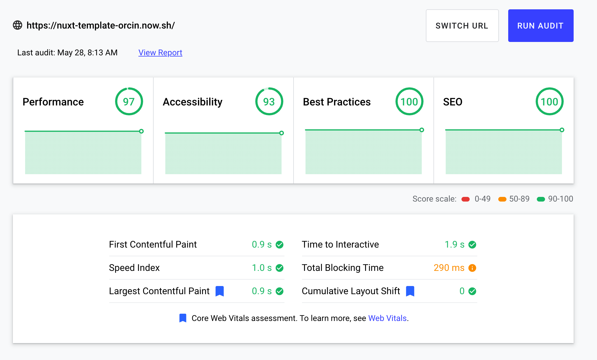

# Nuxt Template

Starter template for Nuxt.js projects.

## Usage

Fork, download, or clone this repository and use it as a starting point for your next Vue.js project.

## Performance



## Commands

The following commands are used to develop the project:

```bash
# install dependencies
$ npm i

# serve with hot reload at localhost:3000
$ npm run dev

# build for production and launch server
$ npm run build
$ npm run start

# generate static project
$ npm run generate

# run unit tests with Jest
$ npm t
```

For detailed explanation on how things work, check out [Nuxt.js docs](https://nuxtjs.org).
